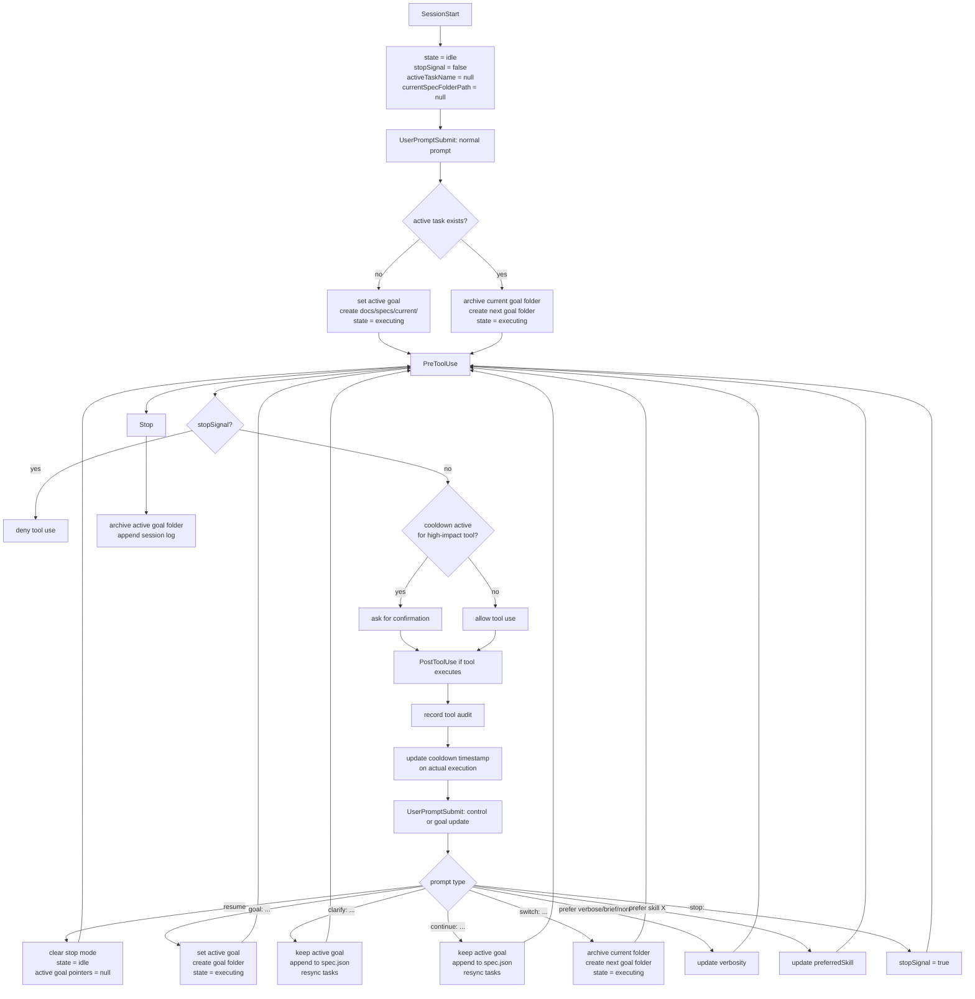

# Hooks

This folder contains the workspace hook configuration and the runtime scripts that back it.

## Layout

```text
.github/hooks/
  orchestrated-agent.json
  runtime/
    .gitignore
  scripts/
    orchestrated_common.mjs
    orchestrated_session_start.mjs
    orchestrated_user_prompt.mjs
    orchestrated_pre_tool.mjs
    orchestrated_post_tool.mjs
    orchestrated_stop.mjs
  tests/
    orchestrated-hooks.test.mjs

docs/
  specs/
    .gitignore
    spec.schema.json
    current/
      <goal-slug>/
        spec.json
    archive/
      <timestamp>-<goal-slug>/
        spec.json
```

## Runtime model

- Hooks are configured in [orchestrated-agent.json](/Users/yiwei.wang/repo/dl-project-template/.github/hooks/orchestrated-agent.json).
- Each hook entry runs plain Node.js against a `.mjs` file in `scripts/`.
- There is no TypeScript compile step and no `dist/` build output to maintain.
- Shared logic lives in [scripts/orchestrated_common.mjs](/Users/yiwei.wang/repo/dl-project-template/.github/hooks/scripts/orchestrated_common.mjs).

## Why plain ESM

The hook runtime was simplified to plain ESM JavaScript so the files executed by the hook config are the same files you edit.

Benefits:

- no build step before hooks can run
- no duplicate source-of-truth between `src/` and `dist/`
- lower maintenance cost for small runtime utilities
- easier debugging because stack traces point at the actual hook files

## Test the hooks

Run the hook test suite from the repository root:

```bash
node --test .github/hooks/tests/orchestrated-hooks.test.mjs
```

This verifies the current behavior for:

- `SessionStart`
- `UserPromptSubmit`
- `PreToolUse`
- `PostToolUse`
- `Stop`

## State model

The hooks persist runtime files directly in the repo under `.github/hooks/runtime/`.

Runtime files:

- `orchestrated-agent-state.json`: persistent hook state and preferences
- `orchestrated-agent-session.json`: current session snapshot for the active task and the tasks extracted from the current spec
- `orchestrated-agent-sessions.jsonl`: append-only session history

The `runtime/` directory is intended to stay in the repo tree for visibility, but the generated JSON and JSONL files are ignored by git.

Core fields:

- `activeTaskName`: the current user goal being tracked
- `conversationState`: either `idle` or `executing`
- `stopSignal`: blocks future tool use until `resume`
- `autoSkillHint`: deterministic repo routing hint inferred from the current prompt (`backend-developer`, `frontend-developer`, or `full-stack`)
- `currentSpecFolderPath`: repo-relative path to the active goal folder in `docs/specs/current/`
- `currentSpecPath`: repo-relative path to the active `spec.json`
- `lastTaskTimestamp`: last actual execution time for cooldown-managed tools
- `toolAudit`: recent tool executions
- `preferences.verbosity`: persisted verbosity preference
- `preferences.preferredSkill`: persisted routing hint

The hooks no longer maintain a queued-task model. They track a single active goal at a time.

## Spec-driven workflow

The hooks now enforce a lightweight spec-driven workflow for each active task.

- Starting a goal creates a folder in `docs/specs/current/<goal-slug>/`
- Each goal folder includes a schema-backed `spec.json`
- The schema lives at `docs/specs/spec.schema.json`
- The prompt guidance tells the agent to brainstorm the spec first
- `clarify:` and `continue:` append updates into arrays inside the active `spec.json`
- The session task list is derived from the explicit `tasks` array in `spec.json`
- Switching goals archives the previous goal folder into `docs/specs/archive/`
- Ending the session also archives the active goal folder into `docs/specs/archive/`

The active spec bundle is intentionally lightweight. It captures:

- goal
- brainstorming notes
- open questions
- constraints
- success criteria
- session notes
- task execution status
- schema versioning metadata

## Command vocabulary

Use these prefixes when you want the hooks to understand your intent explicitly instead of relying on generic prompt replacement behavior.

- `goal: <task>`: start a named goal for the current work session
- `clarify: <constraint or detail>`: add constraints or context without changing the current goal
- `continue: <next step>`: keep the same goal and tell the agent what to do next
- `switch: <new task>`: replace the current goal with a different one
- `stop:`: stop further tool use until `resume`

Examples:

```text
goal: document the hook runtime and state model
clarify: keep the language short and user-facing
continue: add a quick-start section with copyable examples
stop:
switch: add tests for explicit goal commands
```

If no explicit prefix is used, a normal prompt still sets or replaces the active goal.

## Best way to use these hooks

Recommended pattern:

1. Start with `goal:` when you begin a new piece of work.
2. Use `clarify:` when you are tightening requirements for the same goal.
3. Use `continue:` when the goal is unchanged and you are steering the next step.
4. Use `switch:` only when you are intentionally abandoning the current goal and moving to another one.
5. Use `stop:` when you want the hooks to block more tool actions until you explicitly `resume`.

Best sample conversation:

```text
goal: add command-prefix guidance to the hook README
clarify: explain the commands for non-expert users, not just maintainers
continue: add a short best-practice workflow with one realistic example
continue: keep the examples copyable and under 4 lines each
stop:
resume
switch: add regression tests for the new command vocabulary
```

Why this works well:

- the active goal stays stable while you refine it
- clarification does not accidentally look like a brand-new task
- switching work becomes explicit and auditable
- stopping work is explicit and uses the same prefix-based command style
- the hook messages become easier to reason about during longer sessions

## State machine

High-level flow:

1. `SessionStart` resets transient state, restores persisted preferences, and reinitializes the current session snapshot.
2. A normal `UserPromptSubmit` sets or replaces `activeTaskName`, creates an active goal folder under `docs/specs/current/`, and moves the session to `executing`.
3. `PreToolUse` may deny execution if `stopSignal` is active.
4. `PreToolUse` may ask for confirmation when a cooldown-managed tool is requested too soon after a prior real execution.
5. `PostToolUse` appends tool audit data, updates cooldown timing only after an actual tool run, and resyncs session tasks from the current `spec.json`.
6. `UserPromptSubmit` also infers whether repo work looks backend, frontend, or full-stack and injects local skill guidance for `backend-developer`, `frontend-developer`, or both.
7. Explicit prompt prefixes can continue, clarify, or switch the active goal without relying on inference, and `clarify:` or `continue:` append entries to the active `spec.json`.
8. `Stop` archives the active goal folder and appends a session summary to the JSONL session log.

## Repo skill routing

The current `UserPromptSubmit` hook includes deterministic repo-scope routing hints for this monorepo.

Behavior:

- backend-looking prompts inject guidance to use the local `backend-developer` skill
- frontend-looking prompts inject guidance to use the local `frontend-developer` skill
- prompts that look full-stack or mention both sides inject guidance to use both skills together
- prompts that explicitly mention both `backend/` and `frontend/` paths are always treated as coordinated full-stack work and receive an explicit reminder to use both local skills

Current repo-specific routing signals include terms such as:

- backend: `FastAPI`, `Alembic`, `casbin_guard`, `access_policy`, `FastCRUD`, `backend/src/`, `src/migrations`
- frontend: `TanStack`, `routeTree`, `auth-routing`, `request-json`, `GCDS`, `frontend/src/`, `src/routes`, `src/fetch`

This does not replace skill discovery by the agent. It adds explicit runtime context so work in this repo stays aligned with the existing backend and frontend structure and coding standards.

Mermaid diagram:



## Updating an existing hook

1. Edit the relevant file in `scripts/`.
2. Keep hook input parsing and output payloads aligned with the hook contract.
3. Update [tests/orchestrated-hooks.test.mjs](/Users/yiwei.wang/repo/dl-project-template/.github/hooks/tests/orchestrated-hooks.test.mjs) if behavior changes.
4. Re-run the hook test suite.

## Adding a new hook

1. Create a new `.mjs` file in `scripts/`.
2. Add the command entry to [orchestrated-agent.json](/Users/yiwei.wang/repo/dl-project-template/.github/hooks/orchestrated-agent.json).
3. Reuse helpers from [scripts/orchestrated_common.mjs](/Users/yiwei.wang/repo/dl-project-template/.github/hooks/scripts/orchestrated_common.mjs) when possible.
4. Add or extend tests in [tests/orchestrated-hooks.test.mjs](/Users/yiwei.wang/repo/dl-project-template/.github/hooks/tests/orchestrated-hooks.test.mjs).

## Hook design notes

- Keep hooks small and auditable.
- Prefer deterministic behavior over broad natural-language guidance.
- Avoid long-running logic in hook scripts because they block the agent lifecycle.
- Treat the JSON stdin payload as untrusted input and validate fields before using them.
- Do not introduce secrets or environment-specific assumptions into workspace hooks.

## Behavior notes and tradeoffs

- The hooks intentionally track one active goal, not a backlog.
- The hooks keep one active goal folder for the current goal and archive that whole folder when the goal changes or the session ends.
- A later normal user prompt replaces the current active goal instead of being queued.
- Explicit `goal:`, `clarify:`, `continue:`, and `switch:` commands let the user avoid that ambiguity when they want precise behavior.
- `stop:` uses the same explicit command style as the rest of the vocabulary.
- Cooldown prompts are based on real tool execution, not on mere attempts.
- The hooks no longer ask for per-task ratings after tool execution.
- `resume` clears stop mode and resets the active goal so the next prompt starts fresh.
- Preferences such as verbosity and preferred skill survive across sessions.
- The task list is explicit. It is read from the `tasks` array in `spec.json`.

Known tradeoffs:

- The hooks still do not try to infer whether an unprefixed follow-up prompt is a clarification versus a brand-new task. They avoid that ambiguity by always treating a new normal prompt as the current active goal.
- Task status changes should be written into `spec.json`; the hooks mirror that state into the session snapshot.
- This system is intentionally lightweight. It is a policy layer, not a full workflow engine.

## Common commands

Inspect the hook files:

```bash
ls .github/hooks/scripts
```

Run a single hook manually with JSON input:

```bash
printf '{"cwd":"%s"}\n' "$PWD" | node .github/hooks/scripts/orchestrated_session_start.mjs
```